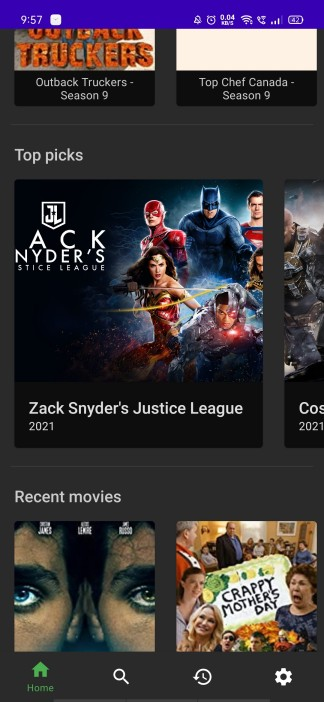
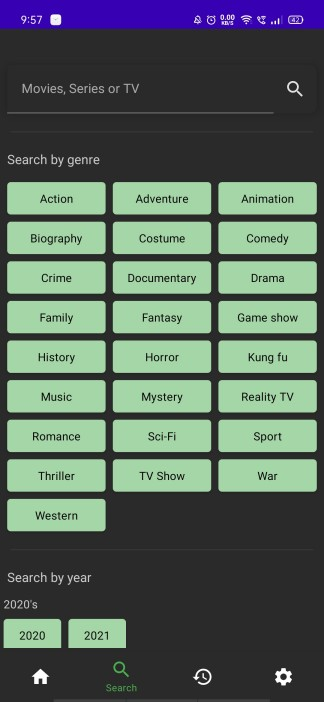
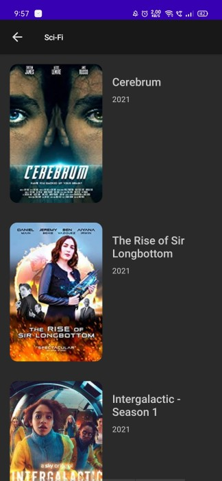
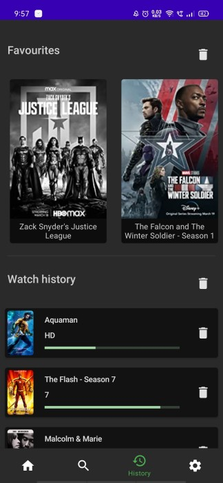
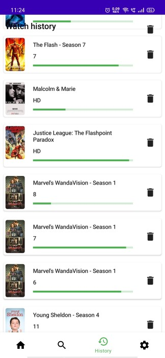
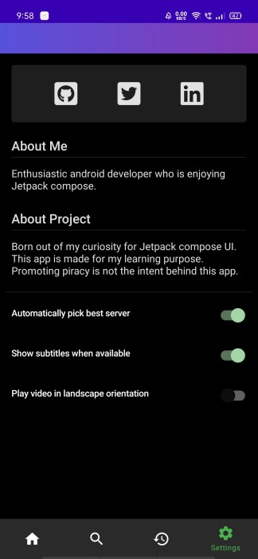
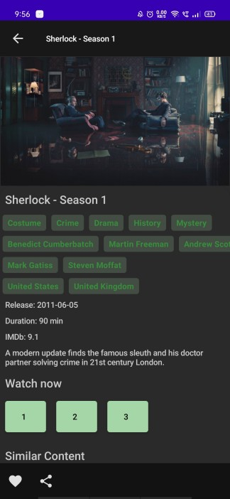
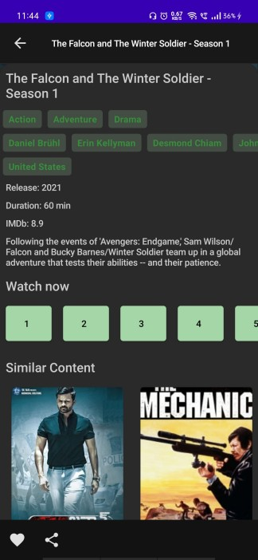

Supaflix
=================

Android online movie player app made with Jetpack Compose and ExoPlayer. It uses Dagger hilt for DI & follows MVVM/MVI architecture. App is only for learning purpose.

[Signed APK](https://drive.google.com/drive/folders/1ehLgIK5VwBX8GI4_9288SNcNZ8EB45km)  

## Screenshots
|  |  | | | |
|----------|:-------------:|:-------------:|:-------------:|:-------------:|  

|  |  | | | |
|----------|:-------------:|:-------------:|:-------------:|:-------------:|  

Application Architecture
------------

[Application Architecture Guide](https://developer.android.com/jetpack/guide) 

Libraries Used
--------------
* [Foundation][0] - Components for core system capabilities, Kotlin extensions and support for
  multidex and automated testing.
  * [AppCompat][1] - Degrade gracefully on older versions of Android.
  * [Android KTX][2] - Write more concise, idiomatic Kotlin code.
  * [Test][4] - An Android testing framework for unit and runtime UI tests.
* [Architecture][10] - A collection of libraries that help you design robust, testable, and
  maintainable apps. Start with classes for managing your UI component lifecycle and handling data
  persistence.
  * [Jetpack Compose][11] - Feature that allows you to more easily write code that interacts with views.
  * [Lifecycles][12] - Create a UI that automatically responds to lifecycle events.
  * [LiveData][13] - Build data objects that notify views when the underlying database changes.
  * [Navigation][14] - Handle everything needed for in-app navigation.
  * [Room][16] - Access your app's SQLite database with in-app objects and compile-time checks.
  * [ViewModel][17] - Store UI-related data that isn't destroyed on app rotations. Easily schedule
     asynchronous tasks for optimal execution.
* [UI][30] - Details on why and how to use UI Components in your apps - together or separate
  * [Animations & Transitions][31] - Move widgets and transition between screens.
  * [Fragment][34] - A basic unit of composable UI.
  * [Layout][35] - Lay out widgets using different algorithms.
  * [Material design](https://material.io/design) - Material is an adaptable system of guidelines, components, and tools that support the best practices of user interface design.
* Third party and miscellaneous libraries
  * [Coil][90] for image loading
  * [Accompanist][95] is a group of libraries which aim to supplement Jetpack Compose with features which are commonly required by developers, but not yet available.
  * [Hilt][92]: for [dependency injection][93]
  * [Kotlin Coroutines][91] for managing background threads with simplified code and reducing needs for callbacks
  * [Gson][94] is a Java library that can be used to convert Java Objects into their JSON representation.
  * [Retrofit](https://square.github.io/retrofit/) - Retrofit is a REST Client library to create an HTTP request and also to process the HTTP response from a REST API.
  * [LeakCanary](https://square.github.io/leakcanary/) - Memory leak detection library for Android.
  * [Lottie Android](https://github.com/airbnb/lottie-android) - Parses Adobe After Effects animations exported as JSON.

[0]: https://developer.android.com/jetpack/components
[1]: https://developer.android.com/topic/libraries/support-library/packages#v7-appcompat
[2]: https://developer.android.com/kotlin/ktx
[4]: https://developer.android.com/training/testing/
[10]: https://developer.android.com/jetpack/arch/
[11]: https://developer.android.com/jetpack/compose
[12]: https://developer.android.com/topic/libraries/architecture/lifecycle
[13]: https://developer.android.com/topic/libraries/architecture/livedata
[14]: https://developer.android.com/topic/libraries/architecture/navigation/
[16]: https://developer.android.com/topic/libraries/architecture/room
[17]: https://developer.android.com/topic/libraries/architecture/viewmodel
[30]: https://developer.android.com/guide/topics/ui
[31]: https://developer.android.com/training/animation/
[34]: https://developer.android.com/guide/components/fragments
[35]: https://developer.android.com/guide/topics/ui/declaring-layout
[90]: https://google.github.io/accompanist/coil/
[91]: https://kotlinlang.org/docs/reference/coroutines-overview.html
[92]: https://developer.android.com/training/dependency-injection/hilt-android
[93]: https://developer.android.com/training/dependency-injection
[94]: https://github.com/google/gson
[95]: https://google.github.io/accompanist/

Android Studio IDE setup
------------------------
For development, the latest version of Android Studio is required. The latest version can be
downloaded from [here](https://developer.android.com/studio/).

Getting Started
---------------
This project uses the Gradle build system. To build this project, use the
`gradlew build` command or use "Import Project" in Android Studio.

For more resources on learning Android development, visit the
[Developer Guides](https://developer.android.com/guide/) at
[developer.android.com](https://developer.android.com).

Support
-------
If you've found an error in this repo, please file an [issue](https://github.com/ShivamKumarJha/supaflix/issues).

Patches are encouraged, and may be submitted by making changes in a new branch 
and submitting a pull request through GitHub.

References
-------
* [Compose samples](https://github.com/android/compose-samples)
* [ComposeCookBook](https://github.com/Gurupreet/ComposeCookBook)
* [ComposeVideoPlayer](https://github.com/halilozercan/ComposeVideoPlayer)
